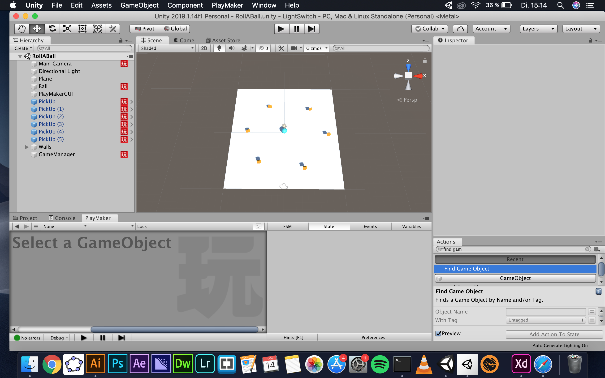

# RollABall_sloos

### Project description: 
Ball rolling around collecting cubes.

### Development platform: 
Unity version 2019.1.14f1
Visual Studio Community 2017
Mac Os Mojave Version 10.14.6

### Target platform: 

### Visuals: 

### Necessary setup/execution steps: 
Install playmaker

### Third party material: 
None

### Project state: 
-counter for pickups
-time counter
-scenes for beginning and end

### Limitations: 
None

### Lessons Learned: 

---
Copyright by sloos 